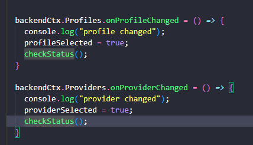

# EnterpriseScraping

A very basic, and very over engineered attempt at search result scraping.
nb: the `scraping-frontend` project althrough hosted in the visual studio solution, was developed in VSCode.

# Getting started
To get the app started, you will need to:
* set-up and seed the database.
* create the application settings.

## Seed database
At the root of the _DbService_ project is file `seed.sql`. This has been generated by entity framework, and can be run against an empty database.
Otherwise for those of you with Visual Studio->Package mangager, ensure you have a connection string setup in the WEbApi Project, _ScrapingBackend_ (See below), and run `Update-Database`

# Application Settings
The only setting required is `"DbConn"` (A blank entry is in the `appsettings.json`)
This is a the SQL Server connection string, ensure you have Multiple Active Result Sets (MARS) enabled in your connection string:
`MultipleActiveResultSets=true `

# Overview

It's a fairly standard Node SPA frontend (React/NextJS with Tailwind css), with a Web-Api project backend, talking to a database for storing records.

Simply choose a user profile, the search provder, and then enter your search terms and press `Search`.
The results are stored in the database, and returned to the screen. _Positions Found_ field will list the total number of records searched, and which records container the https://infotrack.co.uk address.

# ScrapingAppDefinitions project
This holds the interfaces and models that describe the app domain.
All others projects will need to reference this project.
For the basic models `records` have been used as they have a pithy syntax, and there is no downside to not using them.
The abstract `BaseAppModel` creates a basic Id field that all our models must use.  This allows us to use generics in the database layer as we can assume the Id field is always present. This could have also been implemented as an interface, on  a normal class DTO.

### Result Type
This was a bit of fun. Instead if having good paths and exceptions through the app, I added `Result` type. This allows for 'Railway Style' programming, where you can choose the route of your application based on the result returned.
In some functional languages `Result` is a primitive, but here I've just created a basic Generic Result, and an explict ErrorResult for methods that did not need to return values.
The value here is that we can handle errors inside our normal code path, and not have to throw exceptions to manage logic. This means that when Exceptions are thrown they are *exceptional*. 
IN the `SearchController Delete` method, you can see I also used pattern matching to discrimate the result.

# Db Service
Code First Entity Framework project, whilst the `AppDbCOntext` is publice, all DbSets and Db entities are internal to the project, so as not to be leaked all over the application.
Three tables USerPRofile, SearchProviders, UserSearches.
Every search made is saved in the UserSearches, the user profile was going to be a way of seperating out the requests.

The DbEntites all had a `Created` and `Updated` field added as a simple aufit mechanism. These are updated when the application saves/creates the entries, from the `SaveChanges` methods being overridden in the dbContext class.
The audit-fields are applied to the database by implementing `IEntityTypeCOnfiguration<T>` interface, and then added a further instance for each DbSet entity. (Builders directory)
The Repositories are all built from an abstract `BaseRepository<Db,App>`. Adding the DbModel as generic paramter, means we can use the Dbcontext.Set<DbModel> to pick the correct entity for us at runtime.
And having the conversion routines (ToDb/ToAppModel) injected in to the constructor from each instance makes this a lightweight method to get repos up and running.
Becuase you need to the change tracker to update the Audit fields, it must be enabled. This can be tricky with multiple updates in a method. However you can clear the ChangeTracker between calls.
Each DbEnties implements the `BaseRepository`, and then implements the relevant Interface from the `ScrapingAppDefinitions`. This is a very neat way of using the type system. Generally the Get and GetALl methods were added in the classes directly.(there is a bug with the userprofile gEtall not returning a ResultType.)
Each classes also provides it's own static methods to Convert between entity types. Static is used becuase no state is required.

# Web Api project
Simple Web-Api project, the DbService, and ScraperService are setup via DI, and injected to the controllers as required.
The Controllers themselves are incredibly basic and if an error occurs in the app, we respond with a server error(500).
We've also injected Loggers into each of the Services, and they are created as part of the Web-Api di.
CORS is setup to accept localhost:3000 with basic headers. This is complimented on the web-frontend by explictly using `mode: 'cors'` on fetch requsts.
(CORS Probably should have managed inside a #if DEBUG pre-processor directive )
The search service when you call NEwSearch directs the result to the DbService before returning the completed result for the front end to display.

# ScraperService
The actual scraping itself.
You provide a SearchPRovider ID, and we inject the DBService into the search method to retrieve it. This could have been done any number of ways, but it should use of the `Scoped Service` lifetime. Where one dbService is shared by all the services in the same scope.
Switching on the title of the Provdier, is not robust but works for this demo.
Each provider has it's own method for extract results.
* Google -> Http Client (it will work maybe once, before Google asks if you are a robot, or redirects you to captua page)
* Google (alt) -> Selenium and Chrome driver to get the results (Never used this before.) Handles the cookie request page too.
* Dogpile -> Selenium and Chrome driver to get the results

This is where I made my mistake, as I thought (very, very naively) it would be easy to run the scrape, but It took up most of my time and I didn't get to finish up the trending features (let alone the web app styling). I should have spent a little more time reasearching the state of the art for scraping. For instance, the google results from a `HttpClient` object are not the same as the search results from a browser, and so many other little issues. 

# Scraping-frontend
Typescript -> React/NextJs with Tailwind CSS.
First time I've used NExtJs, as I wanted to try out the ServerSide rendering features, but I didn't get to that.
I used the React Context as Dependency Injector for the `BackendApiService.ts`, this automatically means that all views in that context must be client side views.
The dropdowns to select profiles are their own components, but the interesting part is that bother `Profiles`, and `Providers` have an `onChanged` event that is subscribed to in the Page.tsx

This meant i did not need to have a callback in the components when their selected values changed, and all the logic could stay in the parenet component.

# Testing Projects
The *BackEndTesting* project are basic tests for the DB tables.
The *ScrapingBackend.http* simple tests of the http methods in the webapi.
